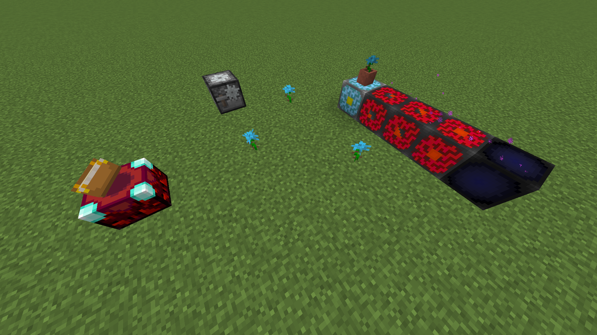

# Pocket Edition Nostalgia
A resourcepack for Bedrock (coming soon) and Java that brings back some Pocket Edition Alpha textures and models
* Poppy replaced with cyan Rose
* Stonecutter given with Pocket Edition Alpha model and texture
* Barrier renamed to Invisible Bedrock (the stuff that forms the border of old-style worlds)
* Obsidan on enchanting table replaced with glowing obsidian (makes more sense anyway, since the table glows)
* Respawn Anchor replaced with Nether Reactor Core (with a couple extra textures)

